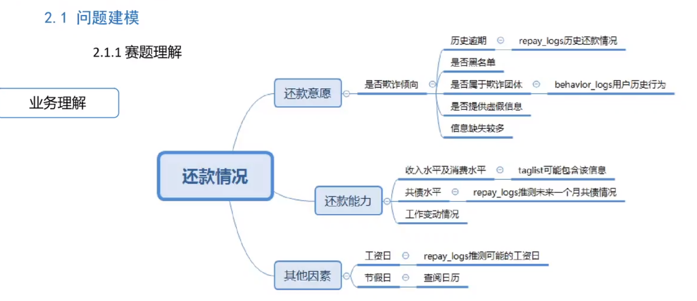
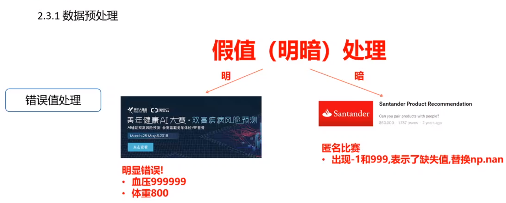
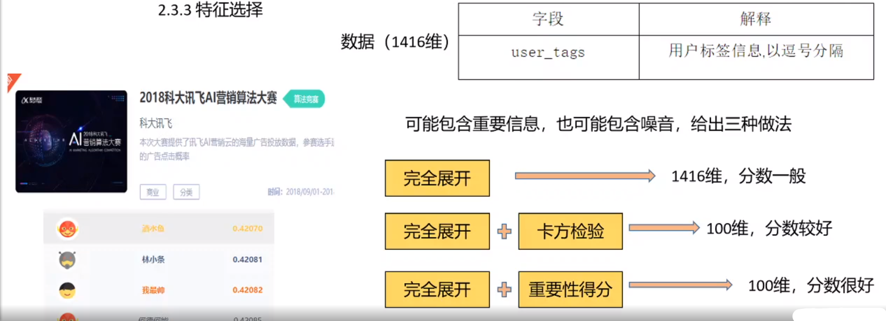

# Task 01:赛题理解

> 对于赛题理解部分，我大部分引用了官网的描述。

## 赛题背景

本次新人赛是Datawhale与天池联合发起的0基础入门系列赛事第四场 —— 零基础入门金融风控-贷款违约预测。

赛题以金融风控中的个人信贷为背景，要求选手根据贷款申请人的数据信息预测其是否有违约的可能，以此判断是否通过此项贷款，这是一个典型的分类问题。通过这道赛题来引导大家了解金融风控中的一些业务背景，解决实际问题，帮助竞赛新人进行自我练习、自我提高。

## 赛题数据

赛题以预测用户贷款是否违约为任务，数据集报名后可见并可下载，该数据来自某信贷平台的贷款记录，总数据量超过120w，包含47列变量信息，其中15列为匿名变量。为了保证比赛的公平性，将会从中抽取80万条作为训练集，20万条作为测试集A，20万条作为测试集B，同时会对employmentTitle、purpose、postCode和title等信息进行脱敏。

### 字段表

|     **Field**      |                       **Description**                        |
| :----------------: | :----------------------------------------------------------: |
|         id         |                为贷款清单分配的唯一信用证标识                |
|      loanAmnt      |                           贷款金额                           |
|        term        |                       贷款期限（year）                       |
|    interestRate    |                           贷款利率                           |
|    installment     |                         分期付款金额                         |
|       grade        |                           贷款等级                           |
|      subGrade      |                        贷款等级之子级                        |
|  employmentTitle   |                           就业职称                           |
|  employmentLength  |                        就业年限（年）                        |
|   homeOwnership    |              借款人在登记时提供的房屋所有权状况              |
|    annualIncome    |                            年收入                            |
| verificationStatus |                           验证状态                           |
|     issueDate      |                        贷款发放的月份                        |
|      purpose       |               借款人在贷款申请时的贷款用途类别               |
|      postCode      |         借款人在贷款申请中提供的邮政编码的前3位数字          |
|     regionCode     |                           地区编码                           |
|        dti         |                          债务收入比                          |
| delinquency_2years |       借款人过去2年信用档案中逾期30天以上的违约事件数        |
|    ficoRangeLow    |            借款人在贷款发放时的fico所属的下限范围            |
|   ficoRangeHigh    |            借款人在贷款发放时的fico所属的上限范围            |
|      openAcc       |              借款人信用档案中未结信用额度的数量              |
|       pubRec       |                      贬损公共记录的数量                      |
| pubRecBankruptcies |                      公开记录清除的数量                      |
|      revolBal      |                       信贷周转余额合计                       |
|     revolUtil      | 循环额度利用率，或借款人使用的相对于所有可用循环信贷的信贷金额 |
|      totalAcc      |              借款人信用档案中当前的信用额度总数              |
| initialListStatus  |                      贷款的初始列表状态                      |
|  applicationType   |       表明贷款是个人申请还是与两个共同借款人的联合申请       |
| earliesCreditLine  |              借款人最早报告的信用额度开立的月份              |
|       title        |                     借款人提供的贷款名称                     |
|     policyCode     |      公开可用的策略_代码=1新产品不公开可用的策略_代码=2      |
|   n系列匿名特征    |        匿名特征n0-n14，为一些贷款人行为计数特征的处理        |

## 评测标准

提交结果为每个测试样本是1的概率，也就是y为1的概率。评价方法为AUC评估模型效果（越大越好）。

## 结果提交

提交前请确保预测结果的格式与sample_submit.csv中的格式一致，以及提交文件后缀名为csv。

形式如下：

```
id,isDefault
800000,0.5
800001,0.5
800002,0.5
800003,0.5
```

##### 分类算法常见的评估指标如下：

1、混淆矩阵（Confuse Matrix）

- （1）若一个实例是正类，并且被预测为正类，即为真正类TP(True Positive )
- （2）若一个实例是正类，但是被预测为负类，即为假负类FN(False Negative )
- （3）若一个实例是负类，但是被预测为正类，即为假正类FP(False Positive )
- （4）若一个实例是负类，并且被预测为负类，即为真负类TN(True Negative )

2、准确率（Accuracy） 准确率是常用的一个评价指标，但是不适合样本不均衡的情况。 $$Accuracy = \frac{TP + TN}{TP + TN + FP + FN}$$

3、精确率（Precision） 又称查准率，正确预测为正样本（TP）占预测为正样本(TP+FP)的百分比。 $$Precision = \frac{TP}{TP + FP}$$

4、召回率（Recall） 又称为查全率，正确预测为正样本（TP）占正样本(TP+FN)的百分比。 $$Recall = \frac{TP}{TP + FN}$$

5、F1 Score 精确率和召回率是相互影响的，精确率升高则召回率下降，召回率升高则精确率下降，如果需要兼顾二者，就需要精确率、召回率的结合F1 Score。 $$F1-Score = \frac{2}{\frac{1}{Precision} + \frac{1}{Recall}}$$

6、P-R曲线（Precision-Recall Curve） P-R曲线是描述精确率和召回率变化的曲线

[](https://camo.githubusercontent.com/25688baabbff569136e19f04c812ed80af778351/68747470733a2f2f696d672d626c6f672e6373646e696d672e636e2f32303230303931333031303232363132352e706e67)

7、ROC（Receiver Operating Characteristic）

- ROC空间将假正例率（FPR）定义为 X 轴，真正例率（TPR）定义为 Y 轴。

TPR：在所有实际为正例的样本中，被正确地判断为正例之比率。 $$TPR = \frac{TP}{TP + FN}$$ FPR：在所有实际为负例的样本中，被错误地判断为正例之比率。 $$FPR = \frac{FP}{FP + TN}$$

[](https://camo.githubusercontent.com/2dfea351fa5eac42caab9e716aa76a20553e4103/68747470733a2f2f696d672d626c6f672e6373646e696d672e636e2f32303230303931333031303232363132342e706e67)

8、AUC(Area Under Curve) AUC（Area Under Curve）被定义为	ROC曲线	下与坐标轴围成的面积，显然这个面积的数值不会大于1。又由于ROC曲线一般都处于y=x这条直线的上方，所以AUC的取值范围在0.5和1之间。AUC越接近1.0，检测方法真实性越高;等于0.5时，则真实性最低，无应用价值。

##### 对于金融风控预测类常见的评估指标如下:

1、KS(Kolmogorov-Smirnov) KS统计量由两位苏联数学家A.N. Kolmogorov和N.V. Smirnov提出。在风控中，KS常用于评估模型区分度。区分度越大，说明模型的风险排序能力（ranking ability）越强。 K-S曲线与ROC曲线类似，不同在于

- ROC曲线将真正例率和假正例率作为横纵轴
- K-S曲线将真正例率和假正例率都作为纵轴，横轴则由选定的阈值来充当。 公式如下： $$KS=max(TPR-FPR)$$ KS不同代表的不同情况，一般情况KS值越大，模型的区分能力越强，但是也不是越大模型效果就越好，如果KS过大，模型可能存在异常，所以当KS值过高可能需要检查模型是否过拟合。以下为KS值对应的模型情况，但此对应不是唯一的，只代表大致趋势。

| KS（%） | 好坏区分能力         |
| ------- | -------------------- |
| 20以下  | 不建议采用           |
| 20-40   | 较好                 |
| 41-50   | 良好                 |
| 51-60   | 很强                 |
| 61-75   | 非常强               |
| 75以上  | 过于高，疑似存在问题 |

2、ROC

3、AUC

## 数据读取

首先看下数据的结构特征：

```python
import pandas as pd

train_data = pd.read_csv('train.csv')
test_data = pd.read_csv('testA.csv')

train_data.head()	# 观察数据内容
train_data.shape	# 观察数据形状，test数据同理
```

这里是使用jupyter notebook来处理的

| id   | loanAmnt | term    | interestRate | installment | grade  | subGrade | employmentTitle | employmentLength | homeOwnership | ...  | n5   | n6   | n7   | n8   | n9   | n10  | n11  | n12  | n13  | n14  |      |
| ---- | -------- | ------- | ------------ | ----------- | ------ | -------- | --------------- | ---------------- | ------------- | ---- | ---- | ---- | ---- | ---- | ---- | ---- | ---- | ---- | ---- | ---- | ---- |
| 0    | 0        | 35000.0 | 5            | 19.52       | 917.97 | E        | E2              | 320.0            | 2 years       | 2    | ...  | 9.0  | 8.0  | 4.0  | 12.0 | 2.0  | 7.0  | 0.0  | 0.0  | 0.0  | 2.0  |
| 1    | 1        | 18000.0 | 5            | 18.49       | 461.90 | D        | D2              | 219843.0         | 5 years       | 0    | ...  | NaN  | NaN  | NaN  | NaN  | NaN  | 13.0 | NaN  | NaN  | NaN  | NaN  |
| 2    | 2        | 12000.0 | 5            | 16.99       | 298.17 | D        | D3              | 31698.0          | 8 years       | 0    | ...  | 0.0  | 21.0 | 4.0  | 5.0  | 3.0  | 11.0 | 0.0  | 0.0  | 0.0  | 4.0  |
| 3    | 3        | 11000.0 | 3            | 7.26        | 340.96 | A        | A4              | 46854.0          | 10+ years     | 1    | ...  | 16.0 | 4.0  | 7.0  | 21.0 | 6.0  | 9.0  | 0.0  | 0.0  | 0.0  | 1.0  |
| 4    | 4        | 3000.0  | 3            | 12.99       | 101.07 | C        | C2              | 54.0             | NaN           | 1    | ...  | 4.0  | 9.0  | 10.0 | 15.0 | 7.0  | 12.0 | 0.0  | 0.0  | 0.0  | 4.0  |

5 rows × 47 columns


**由于是赛题分析任务，所以没有列举太多分析数据的代码**


## 直播笔记


### 问题建模

分析影响还款情况的因素




#### 分析是否有时间序列


一般来说使用最贴近测试集数据作为验证集


EDA


#### EDA必看


### 特征工程


#### 缺省值处理


#### 错误值处理




#### 假标签处理


### 特征提取


编码方式避免泄露数据

业务交叉构造构造出均价


时序数据有周期性、趋势性、强相关、异常点。


异常点可以进行平滑处理


嵌入法可以使用岭回归



### 必备模型


LightGBM效果很好

### 模型融合


### 赛题理解

匿名特征区分15个特征在做组合


### 思考:

几个问题

1. ROC曲线
2. 低频过滤/平滑处理

## 本节参考

1. [Task1 赛题理解](https://github.com/datawhalechina/team-learning-data-mining/blob/master/FinancialRiskControl/Task1%20%E8%B5%9B%E9%A2%98%E7%90%86%E8%A7%A3.md)
2. [比赛官网](https://tianchi.aliyun.com/competition/entrance/531830/introduction)

