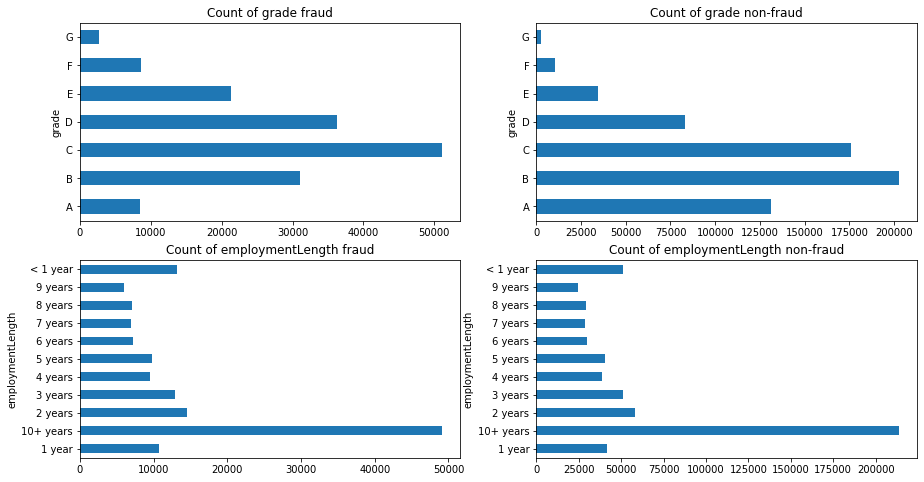

# Task 02: 探索性数据分析（EDA）


```python
# 引入必要的库
import pandas as pd
import numpy as np
import seaborn as sns 
import matplotlib.pyplot as plt
import datetime
import warnings
warnings.filterwarnings('ignore')
```


```python
train_data = pd.read_csv('train.csv')
train_data.head()
```


<div>
<style scoped>
    .dataframe tbody tr th:only-of-type {
        vertical-align: middle;
    }

    .dataframe tbody tr th {
        vertical-align: top;
    }
    
    .dataframe thead th {
        text-align: right;
    }
</style>
<table border="1" class="dataframe">
  <thead>
    <tr style="text-align: right;">
      <th></th>
      <th>id</th>
      <th>loanAmnt</th>
      <th>term</th>
      <th>interestRate</th>
      <th>installment</th>
      <th>grade</th>
      <th>subGrade</th>
      <th>employmentTitle</th>
      <th>employmentLength</th>
      <th>homeOwnership</th>
      <th>...</th>
      <th>n5</th>
      <th>n6</th>
      <th>n7</th>
      <th>n8</th>
      <th>n9</th>
      <th>n10</th>
      <th>n11</th>
      <th>n12</th>
      <th>n13</th>
      <th>n14</th>
    </tr>
  </thead>
  <tbody>
    <tr>
      <td>0</td>
      <td>0</td>
      <td>35000.0</td>
      <td>5</td>
      <td>19.52</td>
      <td>917.97</td>
      <td>E</td>
      <td>E2</td>
      <td>320.0</td>
      <td>2 years</td>
      <td>2</td>
      <td>...</td>
      <td>9.0</td>
      <td>8.0</td>
      <td>4.0</td>
      <td>12.0</td>
      <td>2.0</td>
      <td>7.0</td>
      <td>0.0</td>
      <td>0.0</td>
      <td>0.0</td>
      <td>2.0</td>
    </tr>
    <tr>
      <td>1</td>
      <td>1</td>
      <td>18000.0</td>
      <td>5</td>
      <td>18.49</td>
      <td>461.90</td>
      <td>D</td>
      <td>D2</td>
      <td>219843.0</td>
      <td>5 years</td>
      <td>0</td>
      <td>...</td>
      <td>NaN</td>
      <td>NaN</td>
      <td>NaN</td>
      <td>NaN</td>
      <td>NaN</td>
      <td>13.0</td>
      <td>NaN</td>
      <td>NaN</td>
      <td>NaN</td>
      <td>NaN</td>
    </tr>
    <tr>
      <td>2</td>
      <td>2</td>
      <td>12000.0</td>
      <td>5</td>
      <td>16.99</td>
      <td>298.17</td>
      <td>D</td>
      <td>D3</td>
      <td>31698.0</td>
      <td>8 years</td>
      <td>0</td>
      <td>...</td>
      <td>0.0</td>
      <td>21.0</td>
      <td>4.0</td>
      <td>5.0</td>
      <td>3.0</td>
      <td>11.0</td>
      <td>0.0</td>
      <td>0.0</td>
      <td>0.0</td>
      <td>4.0</td>
    </tr>
    <tr>
      <td>3</td>
      <td>3</td>
      <td>11000.0</td>
      <td>3</td>
      <td>7.26</td>
      <td>340.96</td>
      <td>A</td>
      <td>A4</td>
      <td>46854.0</td>
      <td>10+ years</td>
      <td>1</td>
      <td>...</td>
      <td>16.0</td>
      <td>4.0</td>
      <td>7.0</td>
      <td>21.0</td>
      <td>6.0</td>
      <td>9.0</td>
      <td>0.0</td>
      <td>0.0</td>
      <td>0.0</td>
      <td>1.0</td>
    </tr>
    <tr>
      <td>4</td>
      <td>4</td>
      <td>3000.0</td>
      <td>3</td>
      <td>12.99</td>
      <td>101.07</td>
      <td>C</td>
      <td>C2</td>
      <td>54.0</td>
      <td>NaN</td>
      <td>1</td>
      <td>...</td>
      <td>4.0</td>
      <td>9.0</td>
      <td>10.0</td>
      <td>15.0</td>
      <td>7.0</td>
      <td>12.0</td>
      <td>0.0</td>
      <td>0.0</td>
      <td>0.0</td>
      <td>4.0</td>
    </tr>
  </tbody>
</table>
<p>5 rows × 47 columns</p>
</div>


```python
train_data.shape
```


    (800000, 47)


```python
# 观察数据细节
train_data.info()
```

    <class 'pandas.core.frame.DataFrame'>
    RangeIndex: 800000 entries, 0 to 799999
    Data columns (total 47 columns):
    id                    800000 non-null int64
    loanAmnt              800000 non-null float64
    term                  800000 non-null int64
    interestRate          800000 non-null float64
    installment           800000 non-null float64
    grade                 800000 non-null object
    subGrade              800000 non-null object
    employmentTitle       799999 non-null float64
    employmentLength      753201 non-null object
    homeOwnership         800000 non-null int64
    annualIncome          800000 non-null float64
    verificationStatus    800000 non-null int64
    issueDate             800000 non-null object
    isDefault             800000 non-null int64
    purpose               800000 non-null int64
    postCode              799999 non-null float64
    regionCode            800000 non-null int64
    dti                   799761 non-null float64
    delinquency_2years    800000 non-null float64
    ficoRangeLow          800000 non-null float64
    ficoRangeHigh         800000 non-null float64
    openAcc               800000 non-null float64
    pubRec                800000 non-null float64
    pubRecBankruptcies    799595 non-null float64
    revolBal              800000 non-null float64
    revolUtil             799469 non-null float64
    totalAcc              800000 non-null float64
    initialListStatus     800000 non-null int64
    applicationType       800000 non-null int64
    earliesCreditLine     800000 non-null object
    title                 799999 non-null float64
    policyCode            800000 non-null float64
    n0                    759730 non-null float64
    n1                    759730 non-null float64
    n2                    759730 non-null float64
    n2.1                  759730 non-null float64
    n4                    766761 non-null float64
    n5                    759730 non-null float64
    n6                    759730 non-null float64
    n7                    759730 non-null float64
    n8                    759729 non-null float64
    n9                    759730 non-null float64
    n10                   766761 non-null float64
    n11                   730248 non-null float64
    n12                   759730 non-null float64
    n13                   759730 non-null float64
    n14                   759730 non-null float64
    dtypes: float64(33), int64(9), object(5)
    memory usage: 286.9+ MB


```python

```


```python
train_data.describe()
```


<div>
<style scoped>
    .dataframe tbody tr th:only-of-type {
        vertical-align: middle;
    }

    .dataframe tbody tr th {
        vertical-align: top;
    }
    
    .dataframe thead th {
        text-align: right;
    }
</style>
<table border="1" class="dataframe">
  <thead>
    <tr style="text-align: right;">
      <th></th>
      <th>id</th>
      <th>loanAmnt</th>
      <th>term</th>
      <th>interestRate</th>
      <th>installment</th>
      <th>employmentTitle</th>
      <th>homeOwnership</th>
      <th>annualIncome</th>
      <th>verificationStatus</th>
      <th>isDefault</th>
      <th>...</th>
      <th>n5</th>
      <th>n6</th>
      <th>n7</th>
      <th>n8</th>
      <th>n9</th>
      <th>n10</th>
      <th>n11</th>
      <th>n12</th>
      <th>n13</th>
      <th>n14</th>
    </tr>
  </thead>
  <tbody>
    <tr>
      <td>count</td>
      <td>800000.000000</td>
      <td>800000.000000</td>
      <td>800000.000000</td>
      <td>800000.000000</td>
      <td>800000.000000</td>
      <td>799999.000000</td>
      <td>800000.000000</td>
      <td>8.000000e+05</td>
      <td>800000.000000</td>
      <td>800000.000000</td>
      <td>...</td>
      <td>759730.000000</td>
      <td>759730.000000</td>
      <td>759730.000000</td>
      <td>759729.000000</td>
      <td>759730.000000</td>
      <td>766761.000000</td>
      <td>730248.000000</td>
      <td>759730.000000</td>
      <td>759730.000000</td>
      <td>759730.000000</td>
    </tr>
    <tr>
      <td>mean</td>
      <td>399999.500000</td>
      <td>14416.818875</td>
      <td>3.482745</td>
      <td>13.238391</td>
      <td>437.947723</td>
      <td>72005.351714</td>
      <td>0.614213</td>
      <td>7.613391e+04</td>
      <td>1.009683</td>
      <td>0.199513</td>
      <td>...</td>
      <td>8.107937</td>
      <td>8.575994</td>
      <td>8.282953</td>
      <td>14.622488</td>
      <td>5.592345</td>
      <td>11.643896</td>
      <td>0.000815</td>
      <td>0.003384</td>
      <td>0.089366</td>
      <td>2.178606</td>
    </tr>
    <tr>
      <td>std</td>
      <td>230940.252015</td>
      <td>8716.086178</td>
      <td>0.855832</td>
      <td>4.765757</td>
      <td>261.460393</td>
      <td>106585.640204</td>
      <td>0.675749</td>
      <td>6.894751e+04</td>
      <td>0.782716</td>
      <td>0.399634</td>
      <td>...</td>
      <td>4.799210</td>
      <td>7.400536</td>
      <td>4.561689</td>
      <td>8.124610</td>
      <td>3.216184</td>
      <td>5.484104</td>
      <td>0.030075</td>
      <td>0.062041</td>
      <td>0.509069</td>
      <td>1.844377</td>
    </tr>
    <tr>
      <td>min</td>
      <td>0.000000</td>
      <td>500.000000</td>
      <td>3.000000</td>
      <td>5.310000</td>
      <td>15.690000</td>
      <td>0.000000</td>
      <td>0.000000</td>
      <td>0.000000e+00</td>
      <td>0.000000</td>
      <td>0.000000</td>
      <td>...</td>
      <td>0.000000</td>
      <td>0.000000</td>
      <td>0.000000</td>
      <td>1.000000</td>
      <td>0.000000</td>
      <td>0.000000</td>
      <td>0.000000</td>
      <td>0.000000</td>
      <td>0.000000</td>
      <td>0.000000</td>
    </tr>
    <tr>
      <td>25%</td>
      <td>199999.750000</td>
      <td>8000.000000</td>
      <td>3.000000</td>
      <td>9.750000</td>
      <td>248.450000</td>
      <td>427.000000</td>
      <td>0.000000</td>
      <td>4.560000e+04</td>
      <td>0.000000</td>
      <td>0.000000</td>
      <td>...</td>
      <td>5.000000</td>
      <td>4.000000</td>
      <td>5.000000</td>
      <td>9.000000</td>
      <td>3.000000</td>
      <td>8.000000</td>
      <td>0.000000</td>
      <td>0.000000</td>
      <td>0.000000</td>
      <td>1.000000</td>
    </tr>
    <tr>
      <td>50%</td>
      <td>399999.500000</td>
      <td>12000.000000</td>
      <td>3.000000</td>
      <td>12.740000</td>
      <td>375.135000</td>
      <td>7755.000000</td>
      <td>1.000000</td>
      <td>6.500000e+04</td>
      <td>1.000000</td>
      <td>0.000000</td>
      <td>...</td>
      <td>7.000000</td>
      <td>7.000000</td>
      <td>7.000000</td>
      <td>13.000000</td>
      <td>5.000000</td>
      <td>11.000000</td>
      <td>0.000000</td>
      <td>0.000000</td>
      <td>0.000000</td>
      <td>2.000000</td>
    </tr>
    <tr>
      <td>75%</td>
      <td>599999.250000</td>
      <td>20000.000000</td>
      <td>3.000000</td>
      <td>15.990000</td>
      <td>580.710000</td>
      <td>117663.500000</td>
      <td>1.000000</td>
      <td>9.000000e+04</td>
      <td>2.000000</td>
      <td>0.000000</td>
      <td>...</td>
      <td>11.000000</td>
      <td>11.000000</td>
      <td>10.000000</td>
      <td>19.000000</td>
      <td>7.000000</td>
      <td>14.000000</td>
      <td>0.000000</td>
      <td>0.000000</td>
      <td>0.000000</td>
      <td>3.000000</td>
    </tr>
    <tr>
      <td>max</td>
      <td>799999.000000</td>
      <td>40000.000000</td>
      <td>5.000000</td>
      <td>30.990000</td>
      <td>1715.420000</td>
      <td>378351.000000</td>
      <td>5.000000</td>
      <td>1.099920e+07</td>
      <td>2.000000</td>
      <td>1.000000</td>
      <td>...</td>
      <td>70.000000</td>
      <td>132.000000</td>
      <td>79.000000</td>
      <td>128.000000</td>
      <td>45.000000</td>
      <td>82.000000</td>
      <td>4.000000</td>
      <td>4.000000</td>
      <td>39.000000</td>
      <td>30.000000</td>
    </tr>
  </tbody>
</table>
<p>8 rows × 42 columns</p>
</div>


```python
# nan可视化
missing = train_data.isnull().sum()/len(train_data)
missing = missing[missing > 0]
missing.sort_values(inplace=True)
missing.plot.bar()
```


    <matplotlib.axes._subplots.AxesSubplot at 0x2e6a623c948>


```python
test_data = pd.read_csv('testA.csv')
test_data.head()
```


<div>
<style scoped>
    .dataframe tbody tr th:only-of-type {
        vertical-align: middle;
    }

    .dataframe tbody tr th {
        vertical-align: top;
    }
    
    .dataframe thead th {
        text-align: right;
    }
</style>
<table border="1" class="dataframe">
  <thead>
    <tr style="text-align: right;">
      <th></th>
      <th>id</th>
      <th>loanAmnt</th>
      <th>term</th>
      <th>interestRate</th>
      <th>installment</th>
      <th>grade</th>
      <th>subGrade</th>
      <th>employmentTitle</th>
      <th>employmentLength</th>
      <th>homeOwnership</th>
      <th>...</th>
      <th>n5</th>
      <th>n6</th>
      <th>n7</th>
      <th>n8</th>
      <th>n9</th>
      <th>n10</th>
      <th>n11</th>
      <th>n12</th>
      <th>n13</th>
      <th>n14</th>
    </tr>
  </thead>
  <tbody>
    <tr>
      <td>0</td>
      <td>800000</td>
      <td>14000.0</td>
      <td>3</td>
      <td>10.99</td>
      <td>458.28</td>
      <td>B</td>
      <td>B3</td>
      <td>7027.0</td>
      <td>10+ years</td>
      <td>0</td>
      <td>...</td>
      <td>8.0</td>
      <td>4.0</td>
      <td>15.0</td>
      <td>19.0</td>
      <td>6.0</td>
      <td>17.0</td>
      <td>0.0</td>
      <td>0.0</td>
      <td>1.0</td>
      <td>3.0</td>
    </tr>
    <tr>
      <td>1</td>
      <td>800001</td>
      <td>20000.0</td>
      <td>5</td>
      <td>14.65</td>
      <td>472.14</td>
      <td>C</td>
      <td>C5</td>
      <td>60426.0</td>
      <td>10+ years</td>
      <td>0</td>
      <td>...</td>
      <td>1.0</td>
      <td>3.0</td>
      <td>3.0</td>
      <td>9.0</td>
      <td>3.0</td>
      <td>5.0</td>
      <td>0.0</td>
      <td>0.0</td>
      <td>2.0</td>
      <td>2.0</td>
    </tr>
    <tr>
      <td>2</td>
      <td>800002</td>
      <td>12000.0</td>
      <td>3</td>
      <td>19.99</td>
      <td>445.91</td>
      <td>D</td>
      <td>D4</td>
      <td>23547.0</td>
      <td>2 years</td>
      <td>1</td>
      <td>...</td>
      <td>1.0</td>
      <td>36.0</td>
      <td>5.0</td>
      <td>6.0</td>
      <td>4.0</td>
      <td>12.0</td>
      <td>0.0</td>
      <td>0.0</td>
      <td>0.0</td>
      <td>7.0</td>
    </tr>
    <tr>
      <td>3</td>
      <td>800003</td>
      <td>17500.0</td>
      <td>5</td>
      <td>14.31</td>
      <td>410.02</td>
      <td>C</td>
      <td>C4</td>
      <td>636.0</td>
      <td>4 years</td>
      <td>0</td>
      <td>...</td>
      <td>7.0</td>
      <td>2.0</td>
      <td>8.0</td>
      <td>14.0</td>
      <td>2.0</td>
      <td>10.0</td>
      <td>0.0</td>
      <td>0.0</td>
      <td>0.0</td>
      <td>3.0</td>
    </tr>
    <tr>
      <td>4</td>
      <td>800004</td>
      <td>35000.0</td>
      <td>3</td>
      <td>17.09</td>
      <td>1249.42</td>
      <td>D</td>
      <td>D1</td>
      <td>368446.0</td>
      <td>&lt; 1 year</td>
      <td>1</td>
      <td>...</td>
      <td>11.0</td>
      <td>3.0</td>
      <td>16.0</td>
      <td>18.0</td>
      <td>11.0</td>
      <td>19.0</td>
      <td>0.0</td>
      <td>0.0</td>
      <td>0.0</td>
      <td>1.0</td>
    </tr>
  </tbody>
</table>
<p>5 rows × 48 columns</p>
</div>


```python
test_data.shape
```


    (200000, 48)


```python
train_data.columns
```


    Index(['id', 'loanAmnt', 'term', 'interestRate', 'installment', 'grade',
           'subGrade', 'employmentTitle', 'employmentLength', 'homeOwnership',
           'annualIncome', 'verificationStatus', 'issueDate', 'isDefault',
           'purpose', 'postCode', 'regionCode', 'dti', 'delinquency_2years',
           'ficoRangeLow', 'ficoRangeHigh', 'openAcc', 'pubRec',
           'pubRecBankruptcies', 'revolBal', 'revolUtil', 'totalAcc',
           'initialListStatus', 'applicationType', 'earliesCreditLine', 'title',
           'policyCode', 'n0', 'n1', 'n2', 'n2.1', 'n4', 'n5', 'n6', 'n7', 'n8',
           'n9', 'n10', 'n11', 'n12', 'n13', 'n14'],
          dtype='object')


```python
test_data.columns
```


    Index(['id', 'loanAmnt', 'term', 'interestRate', 'installment', 'grade',
           'subGrade', 'employmentTitle', 'employmentLength', 'homeOwnership',
           'annualIncome', 'verificationStatus', 'issueDate', 'purpose',
           'postCode', 'regionCode', 'dti', 'delinquency_2years', 'ficoRangeLow',
           'ficoRangeHigh', 'openAcc', 'pubRec', 'pubRecBankruptcies', 'revolBal',
           'revolUtil', 'totalAcc', 'initialListStatus', 'applicationType',
           'earliesCreditLine', 'title', 'policyCode', 'n0', 'n1', 'n2', 'n2.1',
           'n2.2', 'n2.3', 'n4', 'n5', 'n6', 'n7', 'n8', 'n9', 'n10', 'n11', 'n12',
           'n13', 'n14'],
          dtype='object')


```python
# 统计缺省值个数
train_data.isnull().sum()
```


    id                        0
    loanAmnt                  0
    term                      0
    interestRate              0
    installment               0
    grade                     0
    subGrade                  0
    employmentTitle           1
    employmentLength      46799
    homeOwnership             0
    annualIncome              0
    verificationStatus        0
    issueDate                 0
    isDefault                 0
    purpose                   0
    postCode                  1
    regionCode                0
    dti                     239
    delinquency_2years        0
    ficoRangeLow              0
    ficoRangeHigh             0
    openAcc                   0
    pubRec                    0
    pubRecBankruptcies      405
    revolBal                  0
    revolUtil               531
    totalAcc                  0
    initialListStatus         0
    applicationType           0
    earliesCreditLine         0
    title                     1
    policyCode                0
    n0                    40270
    n1                    40270
    n2                    40270
    n2.1                  40270
    n4                    33239
    n5                    40270
    n6                    40270
    n7                    40270
    n8                    40271
    n9                    40270
    n10                   33239
    n11                   69752
    n12                   40270
    n13                   40270
    n14                   40270
    dtype: int64


### 寻找数据中没有缺省值或者全是Nan的属性


```python
one_value_feature = [col for col in train_data.columns if train_data[col].nunique() <= 1]

one_value_feature
```


    ['policyCode']


```python
num_fea = list(train_data.select_dtypes(exclude=['object']).columns)# 保留类型为object的列
cat_fea = list(filter(lambda x: x not in num_fea,list(train_data.columns)))# 过滤出不在num_fea中的列

num_fea
```


    ['id',
     'loanAmnt',
     'term',
     'interestRate',
     'installment',
     'employmentTitle',
     'homeOwnership',
     'annualIncome',
     'verificationStatus',
     'isDefault',
     'purpose',
     'postCode',
     'regionCode',
     'dti',
     'delinquency_2years',
     'ficoRangeLow',
     'ficoRangeHigh',
     'openAcc',
     'pubRec',
     'pubRecBankruptcies',
     'revolBal',
     'revolUtil',
     'totalAcc',
     'initialListStatus',
     'applicationType',
     'title',
     'policyCode',
     'n0',
     'n1',
     'n2',
     'n2.1',
     'n4',
     'n5',
     'n6',
     'n7',
     'n8',
     'n9',
     'n10',
     'n11',
     'n12',
     'n13',
     'n14']


```python
cat_fea
```


    ['grade', 'subGrade', 'employmentLength', 'issueDate', 'earliesCreditLine']


```python
train_data.subGrade
```


    0         E2
    1         D2
    2         D3
    3         A4
    4         C2
              ..
    799995    C4
    799996    A4
    799997    C3
    799998    A4
    799999    B3
    Name: subGrade, Length: 800000, dtype: object


```python
# 过滤数值型类别特征
def get_numberical_serial_fea(data,feas):
    num_serial_fea = []
    num_noise_fea = []
    for fea in feas:
        temp = data[fea].nunique()
        if temp <= 10:
            num_noise_fea.append(fea)
            continue
        num_serial_fea.append(fea)
    return num_serial_fea,num_noise_fea

num_serial_fea, num_noise_fea = get_numberical_serial_fea(train_data,num_fea)
```


```python
num_serial_fea
```


    ['id',
     'loanAmnt',
     'interestRate',
     'installment',
     'employmentTitle',
     'annualIncome',
     'purpose',
     'postCode',
     'regionCode',
     'dti',
     'delinquency_2years',
     'ficoRangeLow',
     'ficoRangeHigh',
     'openAcc',
     'pubRec',
     'pubRecBankruptcies',
     'revolBal',
     'revolUtil',
     'totalAcc',
     'title',
     'n0',
     'n1',
     'n2',
     'n2.1',
     'n4',
     'n5',
     'n6',
     'n7',
     'n8',
     'n9',
     'n10',
     'n13',
     'n14']


```python
num_noise_fea
```


    ['term',
     'homeOwnership',
     'verificationStatus',
     'isDefault',
     'initialListStatus',
     'applicationType',
     'policyCode',
     'n11',
     'n12']


```python
train_data['term'].value_counts()
```


    3    606902
    5    193098
    Name: term, dtype: int64


### 可以进行逐个分析观察他们的特征，其他的就不一一列举了


```python
# 每个数字特征的分布可视化
f = pd.melt(train_data,value_vars = num_serial_fea)
g = sns.FacetGrid(f, col="variable", col_wrap=2,sharex=False,sharey=False)
g = g.map(sns.distplot,"value")
```


```python
cat_fea
```


    ['grade', 'subGrade', 'employmentLength', 'issueDate', 'earliesCreditLine']


```python
train_data['grade'].value_counts()
```


    B    233690
    C    227118
    A    139661
    D    119453
    E     55661
    F     19053
    G      5364
    Name: grade, dtype: int64


```python
plt.figure(figsize=(8,8))
sns.barplot(train_data["employmentLength"].value_counts(dropna=False)[:20],
            train_data["employmentLength"].value_counts(dropna=False).keys()[:20])
plt.show()
```


```python
train_fr = train_data.loc[train_data['isDefault']==1]
train_nofr = train_data.loc[train_data['isDefault']==0]
```


```python
fig, ((ax1, ax2), (ax3, ax4)) = plt.subplots(2, 2, figsize=(15, 8))
train_fr.groupby('grade')['grade'].count().plot(kind='barh', ax=ax1, title='Count of grade fraud')
train_nofr.groupby('grade')['grade'].count().plot(kind='barh', ax=ax2, title='Count of grade non-fraud')
train_fr.groupby('employmentLength')['employmentLength'].count().plot(kind='barh', ax=ax3, title='Count of employmentLength fraud')
train_nofr.groupby('employmentLength')['employmentLength'].count().plot(kind='barh', ax=ax4, title='Count of employmentLength non-fraud')
plt.show()
```





```python
fig, ((ax1, ax2)) = plt.subplots(1, 2, figsize=(15, 6))
train_data.loc[train_data['isDefault'] == 1] \
    ['loanAmnt'].apply(np.log) \
    .plot(kind='hist',
          bins=100,
          title='Log Loan Amt - Fraud',
          color='b',
          xlim=(-3, 10),
         ax= ax1)
train_data.loc[train_data['isDefault'] == 0] \
    ['loanAmnt'].apply(np.log) \
    .plot(kind='hist',
          bins=100,
          title='Log Loan Amt - Not Fraud',
          color='g',
          xlim=(-3, 10),
         ax=ax2)
```


    <matplotlib.axes._subplots.AxesSubplot at 0x2e6a73bf088>


```python
total = len(train_data)
total_amt = train_data.groupby(['isDefault'])['loanAmnt'].sum().sum()
plt.figure(figsize=(12,5))
plt.subplot(121)##1代表行，2代表列，所以一共有2个图，1代表此时绘制第一个图。
plot_tr = sns.countplot(x='isDefault',data=train_data)#train_data‘isDefault’这个特征每种类别的数量**
plot_tr.set_title("Fraud Loan Distribution \n 0: good user | 1: bad user", fontsize=14)
plot_tr.set_xlabel("Is fraud by count", fontsize=16)
plot_tr.set_ylabel('Count', fontsize=16)
for p in plot_tr.patches:
    height = p.get_height()
    plot_tr.text(p.get_x()+p.get_width()/2.,
            height + 3,
            '{:1.2f}%'.format(height/total*100),
            ha="center", fontsize=15) 
    
percent_amt = (train_data.groupby(['isDefault'])['loanAmnt'].sum())
percent_amt = percent_amt.reset_index()
plt.subplot(122)
plot_tr_2 = sns.barplot(x='isDefault', y='loanAmnt',  dodge=True, data=percent_amt)
plot_tr_2.set_title("Total Amount in loanAmnt  \n 0: good user | 1: bad user", fontsize=14)
plot_tr_2.set_xlabel("Is fraud by percent", fontsize=16)
plot_tr_2.set_ylabel('Total Loan Amount Scalar', fontsize=16)
for p in plot_tr_2.patches:
    height = p.get_height()
    plot_tr_2.text(p.get_x()+p.get_width()/2.,
            height + 3,
            '{:1.2f}%'.format(height/total_amt * 100),
            ha="center", fontsize=15)     
```


```python
#转化成时间格式  issueDateDT特征表示数据日期离数据集中日期最早的日期（2007-06-01）的天数
train_data['issueDate'] = pd.to_datetime(train_data['issueDate'],format='%Y-%m-%d')
startdate = datetime.datetime.strptime('2007-06-01', '%Y-%m-%d')
train_data['issueDateDT'] = train_data['issueDate'].apply(lambda x: x-startdate).dt.days
```


```python
plt.hist(train_data['issueDateDT'], label='train');
plt.legend();
plt.title('Distribution of issueDateDT dates');
#train 和 test issueDateDT 日期有重叠 所以使用基于时间的分割进行验证是不明智的
```


```python
#透视图 索引可以有多个，“columns（列）”是可选的，聚合函数aggfunc最后是被应用到了变量“values”中你所列举的项目上。
pivot = pd.pivot_table(train_data, index=['grade'], columns=['issueDateDT'], values=['loanAmnt'], aggfunc=np.sum)
```


```python
pivot
```


<div>
<style scoped>
    .dataframe tbody tr th:only-of-type {
        vertical-align: middle;
    }

    .dataframe tbody tr th {
        vertical-align: top;
    }
    
    .dataframe thead tr th {
        text-align: left;
    }
    
    .dataframe thead tr:last-of-type th {
        text-align: right;
    }
</style>
<table border="1" class="dataframe">
  <thead>
    <tr>
      <th></th>
      <th colspan="21" halign="left">loanAmnt</th>
    </tr>
    <tr>
      <th>issueDateDT</th>
      <th>0</th>
      <th>30</th>
      <th>61</th>
      <th>92</th>
      <th>122</th>
      <th>153</th>
      <th>183</th>
      <th>214</th>
      <th>245</th>
      <th>274</th>
      <th>...</th>
      <th>3926</th>
      <th>3957</th>
      <th>3987</th>
      <th>4018</th>
      <th>4048</th>
      <th>4079</th>
      <th>4110</th>
      <th>4140</th>
      <th>4171</th>
      <th>4201</th>
    </tr>
    <tr>
      <th>grade</th>
      <th></th>
      <th></th>
      <th></th>
      <th></th>
      <th></th>
      <th></th>
      <th></th>
      <th></th>
      <th></th>
      <th></th>
      <th></th>
      <th></th>
      <th></th>
      <th></th>
      <th></th>
      <th></th>
      <th></th>
      <th></th>
      <th></th>
      <th></th>
      <th></th>
    </tr>
  </thead>
  <tbody>
    <tr>
      <td>A</td>
      <td>NaN</td>
      <td>53650.0</td>
      <td>42000.0</td>
      <td>19500.0</td>
      <td>34425.0</td>
      <td>63950.0</td>
      <td>43500.0</td>
      <td>168825.0</td>
      <td>85600.0</td>
      <td>101825.0</td>
      <td>...</td>
      <td>13093850.0</td>
      <td>11757325.0</td>
      <td>11945975.0</td>
      <td>9144000.0</td>
      <td>7977650.0</td>
      <td>6888900.0</td>
      <td>5109800.0</td>
      <td>3919275.0</td>
      <td>2694025.0</td>
      <td>2245625.0</td>
    </tr>
    <tr>
      <td>B</td>
      <td>NaN</td>
      <td>13000.0</td>
      <td>24000.0</td>
      <td>32125.0</td>
      <td>7025.0</td>
      <td>95750.0</td>
      <td>164300.0</td>
      <td>303175.0</td>
      <td>434425.0</td>
      <td>538450.0</td>
      <td>...</td>
      <td>16863100.0</td>
      <td>17275175.0</td>
      <td>16217500.0</td>
      <td>11431350.0</td>
      <td>8967750.0</td>
      <td>7572725.0</td>
      <td>4884600.0</td>
      <td>4329400.0</td>
      <td>3922575.0</td>
      <td>3257100.0</td>
    </tr>
    <tr>
      <td>C</td>
      <td>NaN</td>
      <td>68750.0</td>
      <td>8175.0</td>
      <td>10000.0</td>
      <td>61800.0</td>
      <td>52550.0</td>
      <td>175375.0</td>
      <td>151100.0</td>
      <td>243725.0</td>
      <td>393150.0</td>
      <td>...</td>
      <td>17502375.0</td>
      <td>17471500.0</td>
      <td>16111225.0</td>
      <td>11973675.0</td>
      <td>10184450.0</td>
      <td>7765000.0</td>
      <td>5354450.0</td>
      <td>4552600.0</td>
      <td>2870050.0</td>
      <td>2246250.0</td>
    </tr>
    <tr>
      <td>D</td>
      <td>NaN</td>
      <td>NaN</td>
      <td>5500.0</td>
      <td>2850.0</td>
      <td>28625.0</td>
      <td>NaN</td>
      <td>167975.0</td>
      <td>171325.0</td>
      <td>192900.0</td>
      <td>269325.0</td>
      <td>...</td>
      <td>11403075.0</td>
      <td>10964150.0</td>
      <td>10747675.0</td>
      <td>7082050.0</td>
      <td>7189625.0</td>
      <td>5195700.0</td>
      <td>3455175.0</td>
      <td>3038500.0</td>
      <td>2452375.0</td>
      <td>1771750.0</td>
    </tr>
    <tr>
      <td>E</td>
      <td>7500.0</td>
      <td>NaN</td>
      <td>10000.0</td>
      <td>NaN</td>
      <td>17975.0</td>
      <td>1500.0</td>
      <td>94375.0</td>
      <td>116450.0</td>
      <td>42000.0</td>
      <td>139775.0</td>
      <td>...</td>
      <td>3983050.0</td>
      <td>3410125.0</td>
      <td>3107150.0</td>
      <td>2341825.0</td>
      <td>2225675.0</td>
      <td>1643675.0</td>
      <td>1091025.0</td>
      <td>1131625.0</td>
      <td>883950.0</td>
      <td>802425.0</td>
    </tr>
    <tr>
      <td>F</td>
      <td>NaN</td>
      <td>NaN</td>
      <td>31250.0</td>
      <td>2125.0</td>
      <td>NaN</td>
      <td>NaN</td>
      <td>NaN</td>
      <td>49000.0</td>
      <td>27000.0</td>
      <td>43000.0</td>
      <td>...</td>
      <td>1074175.0</td>
      <td>868925.0</td>
      <td>761675.0</td>
      <td>685325.0</td>
      <td>665750.0</td>
      <td>685200.0</td>
      <td>316700.0</td>
      <td>315075.0</td>
      <td>72300.0</td>
      <td>NaN</td>
    </tr>
    <tr>
      <td>G</td>
      <td>NaN</td>
      <td>NaN</td>
      <td>NaN</td>
      <td>NaN</td>
      <td>NaN</td>
      <td>NaN</td>
      <td>NaN</td>
      <td>24625.0</td>
      <td>NaN</td>
      <td>NaN</td>
      <td>...</td>
      <td>56100.0</td>
      <td>243275.0</td>
      <td>224825.0</td>
      <td>64050.0</td>
      <td>198575.0</td>
      <td>245825.0</td>
      <td>53125.0</td>
      <td>23750.0</td>
      <td>25100.0</td>
      <td>1000.0</td>
    </tr>
  </tbody>
</table>
<p>7 rows × 139 columns</p>
</div>


```python
from pandas_profiling import ProfileReport
```


```python
pfr = pandas_profiling.ProfileReport(train_data)
pfr.to_file("./example.html")
```

## 上面的这段代码有问题，库安不上
